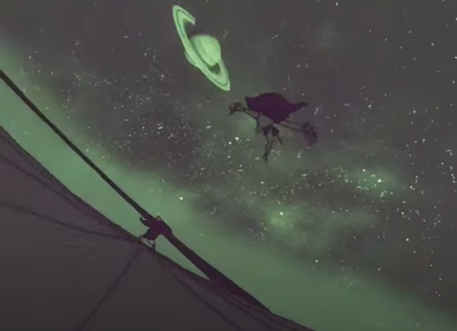

# Guido Roces

## Tecnicatura en programación

## Materias en curso: 
* Programación con objetos I
* Redes
* Matemática II

En cuanto a la materia espero aprender no solo aprobar la misma, la teoría de objetos en particular es algo que ya vengo utilizando
en algunos cursos de desarrollo web tanto en JAVA como en JS, pero con la materia espero profundizar para poder mejorar dichas prácticas.

En este momento me encuetro en un trabajo con poca relación con la carrera, y espero a corto plazo cambiar esa situación. 

## Intereses:
* Musica.
* Cine.
* Lectura.
* Informática.
* Ciencia.
* Medioambiente.
* Fútbol.

